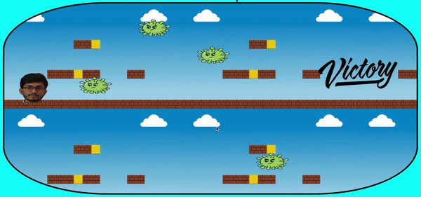

# Virus-Trooper-Game

Tech Stack: HTML, CSS, JavaScript
 

  
Purpose: One can create such games in order to understand the basic concepts of javascript.
 

It's a basic game where you are required to dodge the  objects present in the game and win.

p.s: code looks a bit messy. You can just create a function for checking the overlapping condition and call it accordingly, instead of writing the whole condition again and again.
 

Thank You!   

